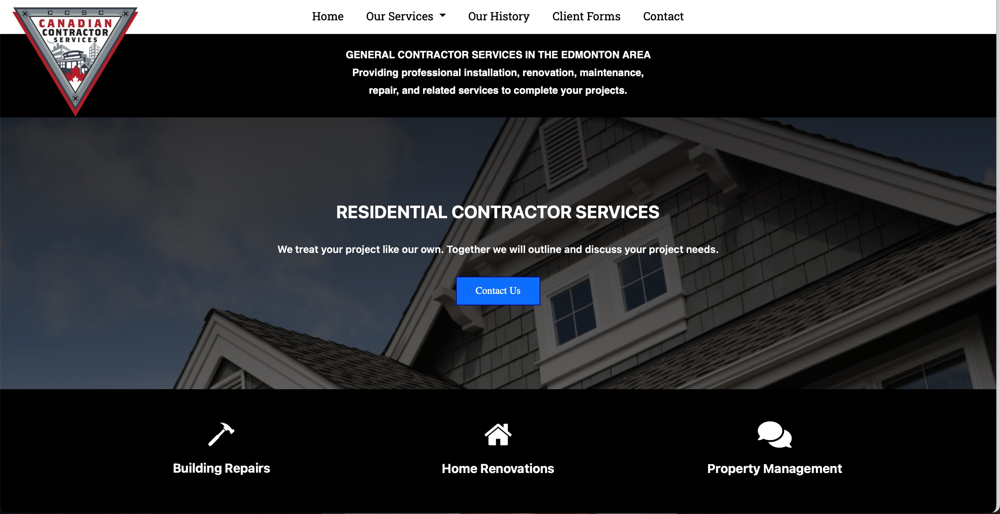

# Canadian Contractor Services Website

Bootstrap website for Canadian Contractor Services.



## Features

- Refined and contemporary design featuring adaptable color schemes and backgrounds.
- Responsive Navbar using Bootstrap
- Utilization of Bootstrap carousel for enhanced user interaction
- Fully responsive web application ensuring compatibility across all devices
- Stylish designed forms and input elements
- Carousel testimonials created for showcasing the diverse experiences and satisfaction levels of our customers, serving as authentic endorsements of products and services.
- Incorporated formspree for Client Forms

## Usage

This website is built with [Bootstrap](https://getbootstrap.com/) and [Sass](https://sass-lang.com/). It uses [Font Awesome](https://fontawesome.com/) for icons.

In order to customize this website, you need to install [Node.js](https://nodejs.org/en/). Then, clone this repository and run:

```bash
npm install
```

This will install Bootstrap, Sass and Font Awesome. To build your CSS files from Sass, run:

```bash
npm run sass:build
```

To watch your Sass files for changes, run:

```bash
npm run sass:watch
```

